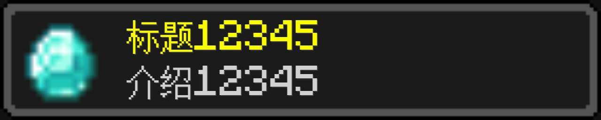
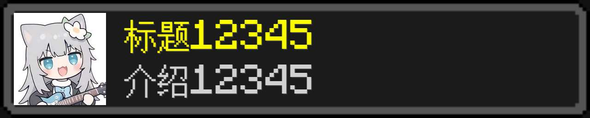
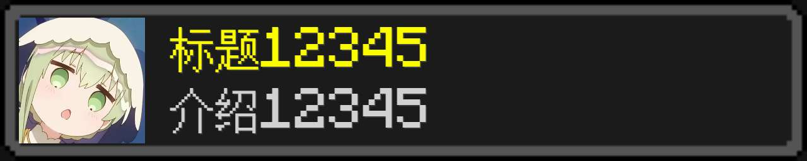
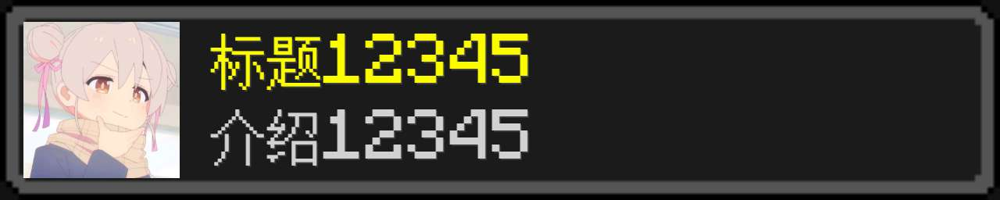
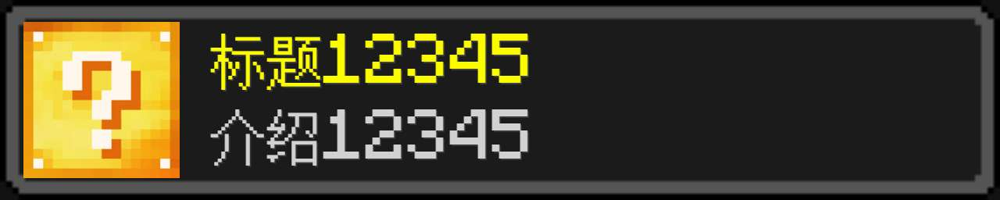
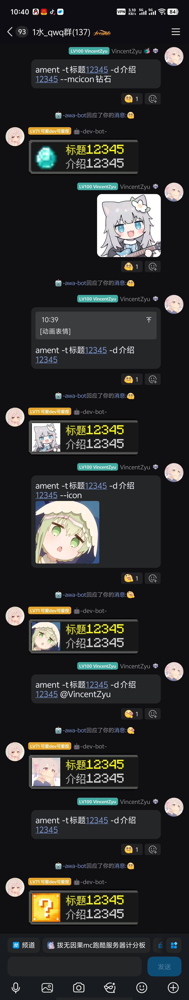
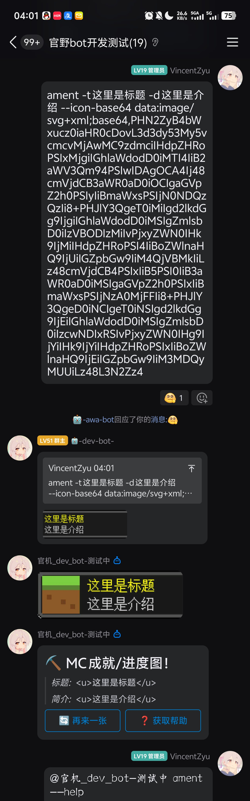
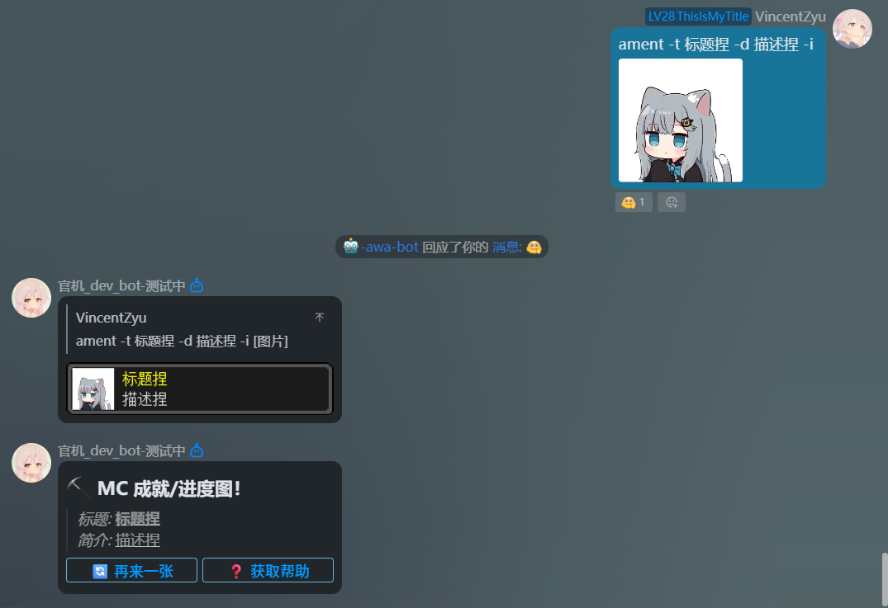

> 前往 [GitHub](https://github.com/VincentZyuApps/koishi-plugin-awa-mc-ament) 或 [Gitee](https://gitee.com/vincent-zyu/koishi-plugin-awa-mc-ament) 阅读 README，获得更佳体验。


# koishi-plugin-awa-mc-ament

[](https://www.npmjs.com/package/koishi-plugin-awa-mc-ament)
[](https://www.npmjs.com/package/koishi-plugin-awa-mc-ament)

[](https://koishi.chat/zh-CN/market/)

[](https://github.com/VincentZyuApps/koishi-plugin-awa-mc-ament)
[](https://gitee.com/vincent-zyu/koishi-plugin-awa-mc-ament)

[](https://forum.koishi.xyz/t/topic/12076)
[](https://qm.qq.com/q/ZN7fxZ3qCq)

<h2>💬 交流反馈</h2>
<p>🐛 Bug 反馈 / 💡 建议 / 👨‍💻 插件开发交流，欢迎加群：</p>
<p><del>💬 插件使用问题 / 🐛 Bug反馈 / 👨‍💻 插件开发交流，欢迎加入QQ群：<b>259248174</b>   🎉（这个群G了）</del></p> 
<p>💬 插件使用问题 / 🐛 Bug反馈 / 👨‍💻 插件开发交流，欢迎加入QQ群：<b>1085190201</b> 🎉</p>
<p>💡 在群里直接艾特我，回复的更快哦~ ✨</p>

🎮 Koishi 插件：awa-mc-ament - Minecraft 进度/成就风格图片 生成器 ，支持自定义标题、描述和图标。

---

## 📦 安装

```bash
yarn add koishi-plugin-awa-mc-ament
# or
npm install koishi-plugin-awa-mc-ament
```
或在 Koishi 控制台的插件市场中搜索 `awa-mc-ament` 安装。

---

## ✨ 功能特性

- 🎨 生成 Minecraft 风格的成就图片
- 🖼️ 支持多种图标来源（游戏图标、引用图片、图片消息段、data: URL、用户头像、默认图标）
- 🎮 可选的 PyTorch 语义搜索后端
- 📸 支持多种图片格式输出（JPEG、PNG、WebP）
- 🔤 自动下载字体文件，无需手动配置
- 🤖 QQ 官方 Bot 平台支持 Markdown + 按钮消息
- 🧪 实验性 `--icon-base64` 参数，直接传入 data: URL 作为图标

---

## 🔍 图标获取优先级

本插件会按照以下优先级自动选择图标来源：

1. 🎮 **Minecraft 游戏图标**（可选，需要启用 [PyTorch 后端服务](https://github.com/VincentZyuApps/fastapi-awa-fuzzy-search-minecraft-backend)）
2. 💬 **引用消息的图片**
3. 🖼️ **参数传入的图片**（`--icon-base64` 优先于 `--icon`）
4. 👤 **@用户的头像**
5. 🎲 **默认幸运方块图标**（fallback）

代码标识符：`MCICON > QUOTEMSG > CMDARG(--icon-base64 > --icon) > ATUSER > LUCKYBLOCK`

---

## 📝 使用示例

### 1️⃣ 使用 Minecraft 游戏图标（需要后端）

```bash
ament -t 挖到钻石！ -d 获得钻石 --mcicon 钻石
```

借助 PyTorch+FastAPI 后端，进行语义相似度检测，选出 Minecraft 图片文件作为 icon。



---

### 2️⃣ 使用引用消息的图片

先引用一条包含图片的消息，然后发送：

```bash
【引用消息...】ament -t 标题 -d 介绍
```

使用引用消息的第一张图片作为 icon。



---

### 3️⃣ 使用传入的图片参数

```bash
ament -t 标题 -d 介绍 --icon [图片]
```

使用传入的 icon 图片参数作为 icon。



---

### 4️⃣ 使用 data: URL 作为图标（实验性）

需先在配置中启用 `enableBase64IconArg`，然后：

```bash
ament -t 标题 -d 介绍 --icon-base64 data:image/svg+xml;base64,<base64数据>
```

直接传入 base64 编码的图片数据，适合不想上传图片的场景。


---

### 5️⃣ 使用 @用户的头像

```bash
ament -t 标题 -d 介绍 @某人
```

使用 session 消息中第一个艾特元素的用户头像作为 icon。



---

### 6️⃣ 使用默认幸运方块图标

```bash
ament -t 标题 -d 介绍
```

fallback 到默认准备好的幸运方块问号 icon。



---

## 📱 聊天平台预览

### OneBotV11



> ↑ 从上到右依次展示 5 种图标来源：--mcicon -> 被引用消息 -> --icon -> 艾特用户的头像 -> 。

### QQ 官方 Bot 平台




> ↑ 在QQ官方Bot平台，启用 `enableQQMarkdown` 后，每次生成图片时会附带 Markdown 消息和按钮: **🔄 再来一张** 和 **❓ 获取帮助**。

> ↑ 分别展示了 `--icon-base64` 和 `--icon` 图片参数的说法

---

## ⚙️ MC 图标后端（可选）

如需使用 `--mcicon` 参数进行 Minecraft 游戏图标搜索，请：

1. 启用配置项中的 **"启用MC图标后端服务"**
2. 自行部署 PyTorch+FastAPI 后端服务
3. 配置后端地址（默认：`http://192.168.31.233:60615`）

**后端项目地址：**  
🔗 [https://github.com/VincentZyuApps/fastapi-awa-fuzzy-search-minecraft-backend](https://github.com/VincentZyuApps/fastapi-awa-fuzzy-search-minecraft-backend)

---

## 🔧 配置项

### 💬 消息设置
| 配置项 | 类型 | 默认值 | 说明 |
|---|---|---|---|
| `enableQuote` | `boolean` | `true` | 是否自动引用回复触发指令的消息 |
| `commandName` | `string` | `"ament"` | 指令名称 |

### ⚙️ Args - 参数相关
| 配置项 | 类型 | 默认值 | 说明 |
|---|---|---|---|
| `banAtUserArg` | `"none" \| "all" \| "qq"` | `"qq"` | @用户作为图标来源的禁用范围（radio 选择） |
| `enableBase64IconArg` | `boolean` | `false` | 启用 `--icon-base64` 参数，允许传入 data: URL |

### 🤖 QQ 官方 Bot 平台设置
| 配置项 | 类型 | 默认值 | 说明 |
|---|---|---|---|
| `enableQQMarkdown` | `boolean` | `true` | 发送图片时附带 Markdown + 按钮消息 |
| `qqMarkdownKeyboardJson` | `string` | 默认键盘 JSON | Markdown 按钮 JSON 配置（支持变量 `${commandName}` `${title}` `${description}` `${userId}`） |

### 📦 Assets - 静态资源相关
| 配置项 | 类型 | 默认值 | 说明 |
|---|---|---|---|
| `fontPath` | `string` | `data/fonts` | 字体文件目录（运行时使用 `ctx.baseDir/data/fonts`，自动下载） |
| `bgPath` | `string[]` | `["data","assets","awa-mc-ament","image"]` | 背景图路径（自动复制） |

### 🌐 Puppeteer - 浏览器截图配置
| 配置项 | 类型 | 默认值 | 说明 |
|---|---|---|---|
| `browserScreenshotquality` | `number` | `80` | 截图质量 (0-100) |
| `browserScreenshotFormat` | `"jpeg" \| "png" \| "webp"` | `"png"` | 截图输出格式 |
| `enableHtmlDump` | `boolean` | `false` | 是否将 HTML 模板写入文件（调试用） |
| `htmlDumpPath` | `string[]` | `["tmp"]` | HTML 模板输出目录 |

### 🎯 MC 图标后端
| 配置项 | 类型 | 默认值 | 说明 |
|---|---|---|---|
| `enableMciconBackend` | `boolean` | `false` | 启用 MC 图标后端服务 |
| `mciconBackendAddres` | `string` | `"http://192.168.31.233:60615"` | 后端地址（完整 URL） |

### 🐛 Debug - 调试
| 配置项 | 类型 | 默认值 | 说明 |
|---|---|---|---|
| `VerboseLoggerMode` | `boolean` | `false` | 是否开启详细输出 |

---

## 🙏 致谢

- 字体：[Minecraft AE](https://www.fontspace.com/minecraft-font-f28180)
- 灵感来源：Minecraft 游戏 [成就（Achievement）](https://minecraft.wiki/w/Achievement) / [进度（Advancement）](https://minecraft.wiki/w/Advancement) 系统
